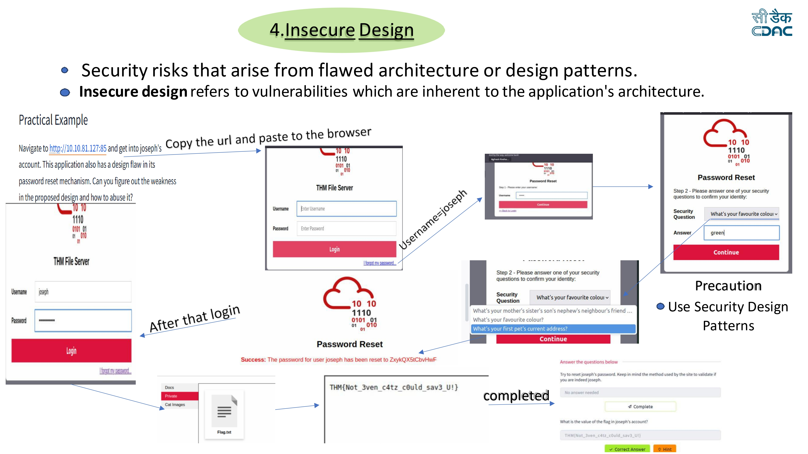

# Insecure Design Lab

## Overview

Insecure Design refers to security weaknesses that occur due to flaws in the application's architecture or design patterns. These vulnerabilities arise when secure design principles are not properly implemented during the development process.

Unlike implementation bugs, insecure design issues originate from poor system planning and can allow attackers to bypass security mechanisms.

---

## Lab Environment

Platform: TryHackMe  
Application: THM File Server

The application contains a design flaw in the password reset mechanism.

---

## Vulnerability Description

The application allows password reset through security questions. However, the design does not properly validate whether the user requesting the reset is actually the account owner.

Because of this flaw, an attacker can attempt to reset the password of another user by answering predictable security questions.

---

## Exploitation Steps

### Step 1 – Access the Web Application

Open the application in the browser.
http://10.10.81.127:85

The login page for the **THM File Server** appears.

---

### Step 2 – Start Password Reset

Click the **Forgot my password** option on the login page.

Enter the username of the target account.

Username: joseph

Click **Continue**.

---

### Step 3 – Security Question Verification

The application asks security questions to verify the identity of the user.

Example question:

What's your favourite colour?

Answer: green

Submit the answer to continue the password reset process.

---

### Step 4 – Password Reset

After answering the security question correctly, the system resets the user's password automatically.

Example response:

Success: The password for user joseph has been reset.

The application provides a newly generated password.

---

### Step 5 – Login to the Account

Return to the login page and authenticate using the credentials.

Username: joseph
Password: <newly generated password>

After logging in successfully, access to the user's files is granted.

---

### Step 6 – Retrieve the Flag

Inside the file storage area, a file named **Flag.txt** is available.

Opening the file reveals the flag:

THM{Not_3ven_c4tz_c0uld_sav3_U!}

---

## Impact

Insecure design vulnerabilities can allow attackers to:

- Reset passwords of other users
- Gain unauthorized account access
- Bypass authentication mechanisms
- Access sensitive data

---

## Mitigation

To prevent insecure design vulnerabilities:

- Implement strong authentication mechanisms
- Avoid predictable security questions
- Use multi-factor authentication (MFA)
- Apply secure design principles during development
- Perform threat modeling during system design

---

## Lab Screenshot

---

## Disclaimer

This repository documents cybersecurity labs completed for educational purposes while learning web application security concepts.
