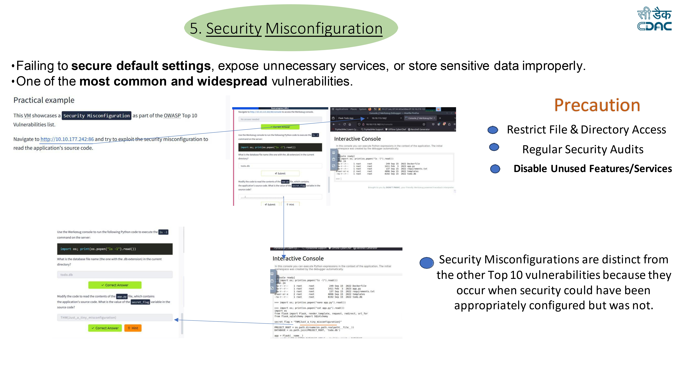

# Security Misconfiguration

## Overview

Security Misconfiguration occurs when systems, applications, or servers are not securely configured.  
This includes leaving default settings enabled, exposing unnecessary services, or improperly protecting sensitive data.

It is one of the most common and widespread vulnerabilities listed in the OWASP Top 10.

---

## Vulnerability Description

Security misconfiguration can happen due to:

- Default credentials remaining unchanged
- Debugging features enabled in production
- Exposed directories or configuration files
- Unnecessary services running on the server
- Incorrect file permissions
- Poorly configured cloud storage or databases

Attackers can exploit these weaknesses to gain unauthorized access to system files or application source code.

---

## Lab Environment

Platform: TryHackMe

This lab demonstrates a **Security Misconfiguration vulnerability** where an exposed debug console allows attackers to execute commands and read application files.

---

## Exploitation Steps

### Step 1 – Access the Application

Open the vulnerable application in the browser.

http://10.10.177.242:86

The application exposes an **interactive debugging console**.

---

### Step 2 – Use the Interactive Console

The console allows execution of Python commands directly on the server.

Example command used to list files:

import os
print(os.popen("ls -l").read())

This command lists files available in the server directory.

---

### Step 3 – Identify Sensitive Files

From the directory listing, a database file is discovered.

Example: todo.db

This file contains application data.

---

### Step 4 – Read Application Source Code

Using the console, the attacker can read application files.

Example command:

print(os.popen("cat app.py").read())

This reveals the application's source code.

---

### Step 5 – Retrieve the Secret Flag

Inside the source code, a secret value is stored.

Example:

secret_flag = "THM{just_a_tiny_misconfiguration}"

This confirms the vulnerability caused by insecure configuration.

---

## Impact

Security misconfiguration vulnerabilities can lead to:

- Exposure of sensitive files
- Access to application source code
- Unauthorized command execution
- Data leaks
- Full server compromise

---

## Mitigation

To prevent security misconfiguration vulnerabilities:

- Restrict file and directory permissions
- Disable debugging features in production environments
- Remove or disable unused services
- Regularly perform security audits
- Apply secure configuration baselines
- Keep systems and software updated

---

## Lab Screenshot

---

## Disclaimer

This repository documents cybersecurity labs completed for educational purposes while learning web application security concepts.
