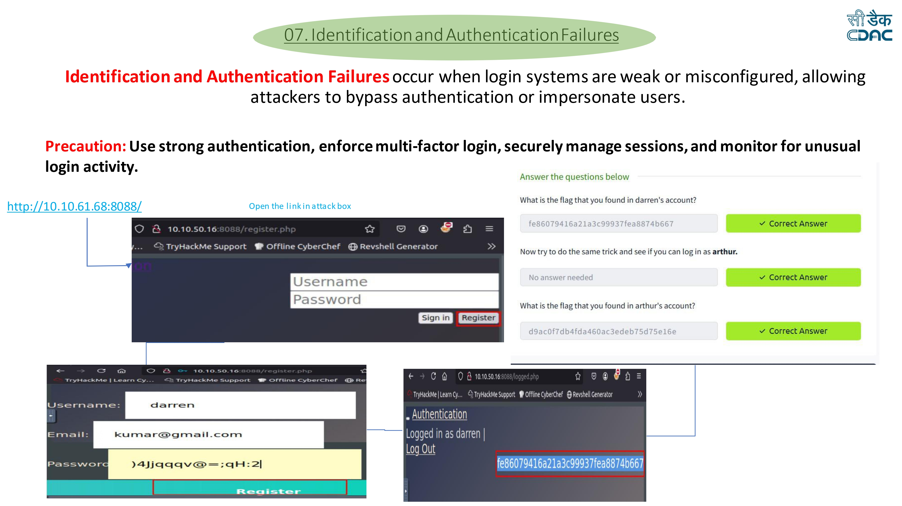

# Identification and Authentication Failures Lab

## Overview

Identification and Authentication Failures occur when an application improperly implements login, session management, or identity verification mechanisms.

Weak authentication systems allow attackers to bypass login controls, impersonate other users, or gain unauthorized access to accounts.

This lab demonstrates how weak authentication logic allows an attacker to access other users' accounts and retrieve sensitive information.

---

## Lab Environment

Platform: TryHackMe  
Application: THM Authentication Lab

The lab contains a web application that allows users to register and log in to view account information.

---

## Vulnerability Description

The application contains a flaw in the authentication mechanism.

User accounts can be accessed without proper verification due to weak session handling and authentication validation.

By registering an account and manipulating the login behavior, an attacker can impersonate other users and access their account information.

---

## Exploitation Steps

## Performed in THM



### Step 1 — Deploy the machine

Start the TryHackMe machine and obtain the target IP address.

Open the application in a browser.

Example:

```
http://10.10.61.68:8088/
```

The web page displays a login interface.

---

### Step 2 — Register a new account

Click the **Register** button to create a new account.

Example credentials:

```
Username: darren
Email: kumar@gmail.com


Password: )4Jjqqqav@=;qH:2|
```

After registration, log in using the created account.

---

### Step 3 — Access the user dashboard

Once logged in, the application displays the authentication page showing the logged-in user.

Example message:


Logged in as darren


The page reveals the first flag.

---

### Step 4 — Capture the first flag

The flag visible on the page is:

```
fe86079416a21a3c99937fea8874b667
```


Submit the flag in the TryHackMe interface.

---

### Step 5 — Log in as another user

Using the same authentication weakness, attempt to log in as another user in the system.

Example user: arthur


The application allows access due to improper authentication validation.

---

### Step 6 — Capture the second flag

After logging in as **arthur**, another flag becomes visible:

```
d9ac0f7db4fda460ac3edeb75d75e16e
```

Submit the flag to complete the lab.

---

## Impact

Identification and Authentication Failures can allow attackers to:

* Bypass login mechanisms
* Impersonate legitimate users
* Access sensitive account data
* Perform unauthorized actions within the system

---

## Mitigation

To prevent authentication vulnerabilities:

* Implement **strong password policies**
* Use **Multi-Factor Authentication (MFA)**
* Secure session management
* Store passwords using **strong hashing algorithms** (e.g., bcrypt, Argon2)
* Implement **rate limiting and account lockout mechanisms**
* Monitor suspicious login activity

---

## Disclaimer

This write-up is for educational purposes and documents a lab exercise completed while learning web application security.
