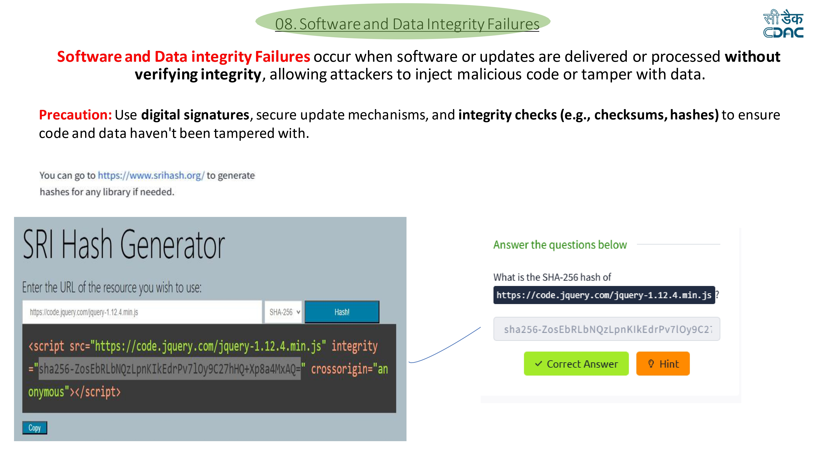
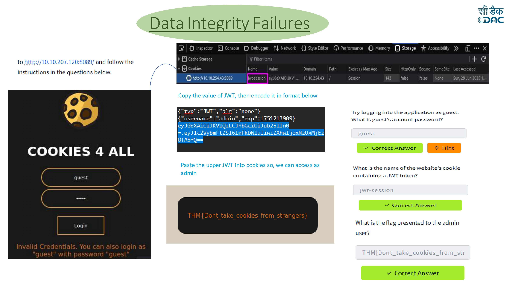

# Software and Data Integrity Failures Lab

## Overview

Software and Data Integrity Failures occur when software updates, libraries, or important data are used without verifying their integrity. If integrity verification is missing, attackers can modify code, inject malicious scripts, or manipulate authentication tokens.

This lab demonstrates two common integrity problems:

1. Subresource Integrity (SRI) verification
2. JWT token manipulation

---

## Lab Environment

Platform: TryHackMe  
Application: Cookies 4 All

The lab environment contains a vulnerable web application that improperly verifies software integrity and JWT tokens.

---

## Vulnerability Description

Applications often load external scripts or libraries from third-party sources such as CDNs. If integrity verification mechanisms like **Subresource Integrity (SRI)** or **digital signatures** are not used, attackers can modify the code being loaded.

Another common issue occurs with **JWT authentication tokens**. If JWT tokens are configured insecurely (for example using `"alg":"none"`), attackers can modify the token payload and escalate privileges.

---

# Part 1 — Subresource Integrity (SRI)

## Exploitation Steps

## Performed in THM




### Step 1 — Identify external resource

The web application loads a JavaScript library from a CDN:

```
https://code.jquery.com/jquery-1.12.4.min.js
```

---

### Step 2 — Generate the SHA-256 hash

Use an SRI Hash Generator to generate the integrity hash for the library.

Example tool:

```
https://www.srihash.org/
```

Enter the resource URL and generate the **SHA-256** hash.

---

### Step 3 — Obtain the integrity value

The generated hash is:

```
sha256-ZosEbRLbNQzLpnKIkEdrPv7lOy9C27hHQ+Xp8a4MxAQ=
```

---

### Step 4 — Implement integrity verification

The script should be included with an integrity attribute:

```html
<script src="https://code.jquery.com/jquery-1.12.4.min.js"
integrity="sha256-ZosEbRLbNQzLpnKIkEdrPv7lOy9C27hHQ+Xp8a4MxAQ="
crossorigin="anonymous"></script>
```

This ensures the browser verifies the file before executing it.

---

# Part 2 — JWT Token Manipulation

## Exploitation Steps




### Step 1 — Open the vulnerable application

Navigate to the target web application.

Example:

```
http://10.10.207.120:8089
```

The login page appears.

---

### Step 2 — Login as guest

The application allows login using:

```
Username: guest
Password: guest
```

After login, inspect the browser cookies.

---

### Step 3 — Identify the JWT cookie

Open **Browser Developer Tools → Storage → Cookies**.

The JWT token is stored in a cookie named:

```
jwt-session
```

---

### Step 4 — Decode the JWT

Copy the token and decode it.

Example payload:

```
{
 "username": "admin",
 "exp": 1751213909
}
```

The header shows a critical vulnerability:

```
{
 "typ": "JWT",
 "alg": "none"
}
```

The **"none" algorithm** means the token is not signed.

---

### Step 5 — Forge an admin token

Because the token is unsigned, attackers can modify the payload.

Create a new token with:

```
{
 "username": "admin"
}
```

Encode the token using Base64 and reconstruct the JWT.

---

### Step 6 — Replace the cookie

Paste the modified JWT into the **jwt-session cookie** in the browser.

Refresh the page.

The application now treats the user as **admin**.

---

### Step 7 — Capture the flag

The admin page reveals the flag:

```
THM{Dont_take_cookies_from_strangers}
```

Submit the flag to complete the lab.

---

## Impact

Software and Data Integrity Failures can allow attackers to:

- Inject malicious code into applications
- Modify software updates
- Tamper with authentication tokens
- Escalate privileges to administrator level
- Compromise the application infrastructure

---

## Mitigation

To prevent integrity failures:

- Use **Subresource Integrity (SRI)** when loading external scripts
- Sign software updates and verify digital signatures
- Avoid insecure JWT algorithms such as `"none"`
- Use strong cryptographic JWT signatures (HS256, RS256)
- Implement secure CI/CD pipelines
- Monitor and verify third-party dependencies

---

## Disclaimer

This write-up is for educational purposes and documents a lab exercise completed while learning web application security.
