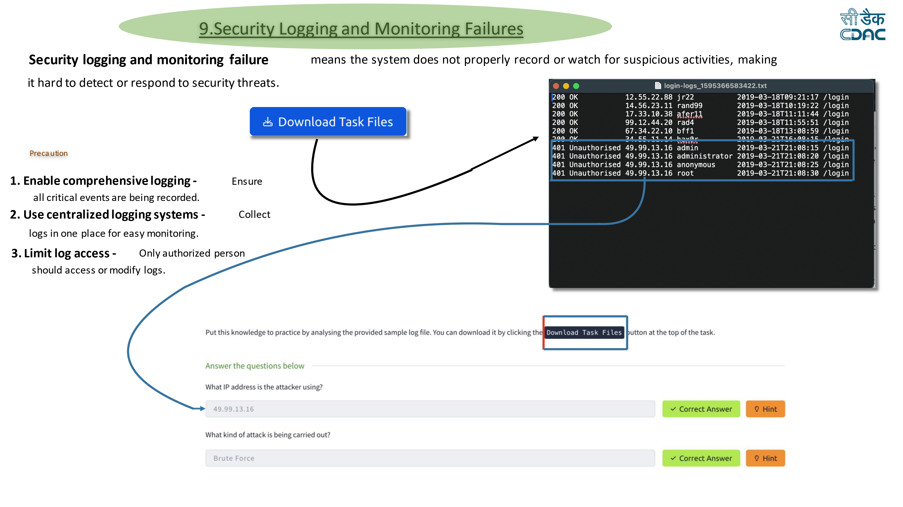

# Security Logging and Monitoring Failures Lab

## Overview

Security Logging and Monitoring Failures occur when applications do not properly log security events or monitor suspicious activities. Without proper logging and monitoring, organizations may fail to detect attacks in time, making incident response and forensic analysis difficult.

This lab demonstrates how analyzing system log files can help identify malicious activity and detect attacks such as brute-force login attempts.

---

## Lab Environment

Platform: TryHackMe  
Application: Log Analysis Lab

The lab provides a sample login log file that contains records of user authentication attempts.

---

## Vulnerability Description

Many systems fail to properly log authentication events or monitor login attempts. Without proper logging mechanisms, attackers can perform repeated login attempts without being detected.

By analyzing authentication logs, security analysts can detect patterns such as:

- Repeated failed login attempts
- Suspicious IP addresses
- Unauthorized access attempts

These patterns may indicate an ongoing attack.

---

## Lab Screenshot



---

## Exploitation / Analysis Steps

### Step 1 — Download the log file

Click the **Download Task Files** button in the TryHackMe lab to obtain the sample log file.

Example file:

```
login-logs.txt
```

---

### Step 2 — Inspect the log entries

Open the log file and review the login records.

Example log entries:

```
200 OK 12.55.22.88 jr22 /login
200 OK 14.56.23.11 rand99 /login
200 OK 17.33.10.38 afer11 /login
401 Unauthorised 49.99.13.16 admin /login
401 Unauthorised 49.99.13.16 administrator /login
401 Unauthorised 49.99.13.16 anonymous /login
401 Unauthorised 49.99.13.16 root /login
```

---

### Step 3 — Identify suspicious activity

The log shows multiple failed login attempts from the same IP address:

```
49.99.13.16
```

This repeated behavior indicates a possible attack.

---

### Step 4 — Determine the attack type

The attacker is attempting multiple usernames in quick succession.

This behavior indicates a **Brute Force Attack**, where an attacker repeatedly tries different credentials to gain unauthorized access.

---

### Step 5 — Capture the answers

From the log analysis:

Attacker IP Address:

```
49.99.13.16
```

Attack Type:

```
Brute Force
```

Submit these answers in the TryHackMe lab to complete the task.

---

## Impact

Security Logging and Monitoring Failures can lead to:

- Undetected cyber attacks
- Delayed incident response
- Difficulty performing forensic investigations
- Increased damage from successful attacks

Without proper logging, organizations may not realize a breach has occurred until significant damage is done.

---

## Mitigation

To prevent security logging and monitoring failures:

- Enable **comprehensive logging** for authentication and system events
- Use **centralized logging systems** (SIEM)
- Monitor logs for suspicious activity
- Implement **alerting mechanisms** for repeated login failures
- Restrict access to sensitive log files
- Regularly review logs for anomalies

---

## Disclaimer

This write-up is for educational purposes and documents a lab exercise completed while learning web application security.
